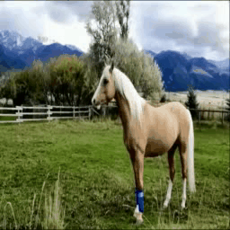
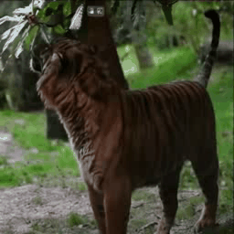
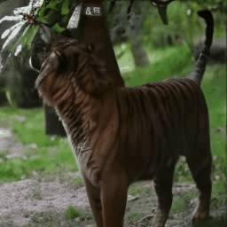
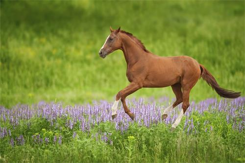

<h1 style="text-align: center;">MAVIN: Multi-Action Video Generation with Diffusion Models via Transition Video Infilling</h1>
Codes will be released here.

## Framework

## Transition Video Infilling Examples

<table>
  <tr>
    <th>GT</th>
    <th>SEINE</th>
    <th>SEINE-Vid</th>
    <th>Dynami</th>
    <th>Dynami-Vid</th>
    <th>Mavin</th>
  </tr>
  <tr>
    <td></td>
    <td></td>
    <td></td>
    <td></td>
    <td></td>
    <td></td>
  </tr>
  <tr>
    <td></td>
    <td></td>
    <td></td>
    <td></td>
    <td></td>
    <td></td>
  </tr>
  <tr>
    <td></td>
    <td></td>
    <td></td>
    <td></td>
    <td></td>
    <td></td>
  </tr>
  <tr>
    <td></td>
    <td></td>
    <td></td>
    <td></td>
    <td></td>
    <td></td>
  </tr>
</table>

## Application Examples

<table>
  <tr>
    <th>Input Horse Image</th>
    <th>Jumping + Standing + Running</th>
  </tr>
  <tr>
    <td align="center"></td>
    <td align="center"></td>
  </tr>
  <tr>
    <th>Input Tiger Image</th>
    <th>Opening Mouth + Turning Head</th>
  </tr>
  <tr>
    <td align="center"></td>
    <td align="center"></td>
  </tr>
</table>

